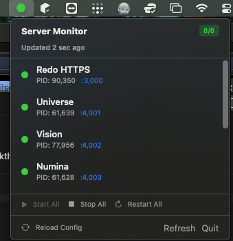

# Server Monitor 🖥️

[](https://www.apple.com/macos/)
[](https://nodejs.org/)
[](./LICENSE)
[](./CONTRIBUTING.md)

A lightweight macOS dev server manager using native `launchd` for reliable, persistent services.

## ✨ Features

- **🔧 CLI Tool (`sm`)** - Manage services from the terminal
- **📱 Menu Bar App** - Quick status view and controls
- **🤖 LLM Integration** - Natural language server management
- **🔄 Auto-restart** - launchd automatically restarts crashed services
- **📊 Health Checks** - HTTP health monitoring
- **📝 Centralized Logs** - All logs in one place

## 🚀 Quick Start

### Install CLI

```bash
git clone https://github.com/yourusername/server-monitor.git
cd server-monitor/cli
npm install
npm link
```

### Basic Usage

```bash
# List all services
sm list

# Check detailed status
sm status

# Start/stop/restart
sm start universe
sm stop numina
sm restart --all

# View logs
sm logs universe
sm logs knomee --error

# Add a new service
sm add --name "My App" --path ~/myproject --port 5000
```

## 📸 Screenshots

### CLI Output
```
┌────────────┬──────┬───────────┬───────┬─────────────────────────────┐
│ Service    │ Port │ Status    │ PID   │ Identifier                  │
├────────────┼──────┼───────────┼───────┼─────────────────────────────┤
│ Frontend   │ 3000 │ ● Running │ 12345 │ com.servermonitor.frontend  │
│ API Server │ 4000 │ ● Running │ 12346 │ com.servermonitor.api       │
│ Worker     │ 5000 │ ○ Stopped │ -     │ com.servermonitor.worker    │
└────────────┴──────┴───────────┴───────┴─────────────────────────────┘

✓ 2/3 services running
```

### Menu Bar App



The SwiftUI menu bar app shows service status at a glance with controls to start, stop, restart, and view logs.

## 📋 Commands

| Command | Description |
|---------|-------------|
| `sm list` | List all services with status |
| `sm status [name]` | Detailed health check |
| `sm start <name\|--all>` | Start service(s) |
| `sm stop <name\|--all>` | Stop service(s) |
| `sm restart <name\|--all>` | Restart service(s) |
| `sm logs <name>` | Tail service logs |
| `sm add [options]` | Add new service |
| `sm remove <name>` | Remove a service |

### Add Options
```bash
sm add \
  --name "My Server" \
  --path ~/project \
  --port 4005 \
  --cmd "npm run dev" \
  --health "http://localhost:4005/health"
```

## 🏗️ Architecture

```
server_monitor/
├── cli/                 # Node.js CLI tool (sm command)
│   ├── src/commands/    # Command implementations
│   └── src/lib/         # Config, launchd, health utilities
├── app/                 # SwiftUI menu bar app (macOS)
│   └── ServerMonitor/
├── logs/                # Service stdout/stderr logs
├── services.json        # Service configuration (user-specific, gitignored)
├── services.example.json # Example configuration template
└── scripts/             # Helper shell scripts
```

## ⚙️ Configuration

Services are defined in `services.json`:

```json
{
  "version": "2.0.0",
  "settings": {
    "logDir": "./logs",
    "identifierPrefix": "com.servermonitor"
  },
  "services": [
    {
      "name": "My App",
      "identifier": "com.servermonitor.my-app",
      "path": "~/projects/my-app",
      "command": ["npm", "run", "dev"],
      "port": 3000,
      "healthCheck": "http://localhost:3000",
      "enabled": true
    }
  ]
}
```

## 💡 How It Works

The CLI uses platform-native process management:

- **macOS**: Uses `launchd` (LaunchAgents) for reliable background services
- **Linux**: *(planned)* systemd units
- **Windows**: *(planned)* Windows Services

Benefits:
- ✅ **Survives terminal close** - Services keep running
- ✅ **Auto-restart** - Crashed services restart automatically  
- ✅ **Boot persistence** - Services start at login
- ✅ **Native integration** - No third-party process managers

## 🔧 Manual Commands (macOS)

```bash
# List managed services
launchctl list | grep servermonitor

# Stop/start a service
launchctl stop com.servermonitor.my-app
launchctl start com.servermonitor.my-app

# View logs
tail -f ./logs/my-app.log
```

## 🐛 Troubleshooting

### Service won't start
```bash
# Check error log
sm logs <name> --error

# Check if port is in use
lsof -i :<port>
```

### Service keeps restarting
Check the error log - the process is likely crashing:
```bash
sm logs <name> --error
```

### CLI command not found
```bash
cd cli && npm link
```

## 📄 License

MIT © Salient Vision Technologies, LLC

## 🙏 Contributing

PRs welcome! See [CONTRIBUTING.md](./CONTRIBUTING.md).
